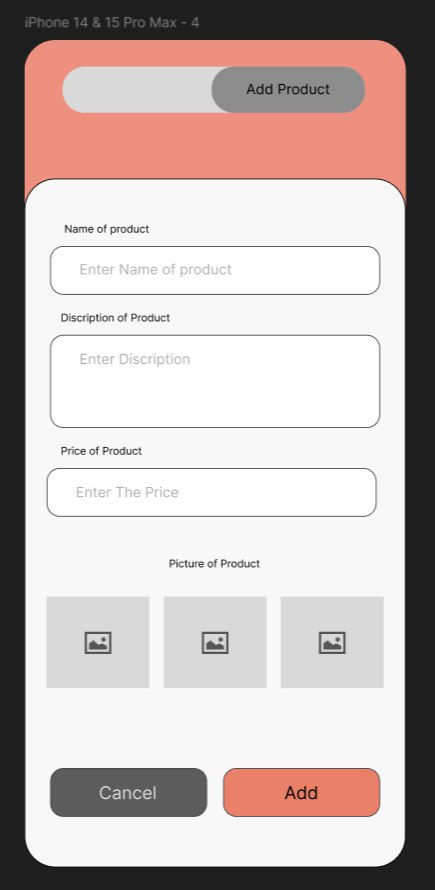

# Task 3: Understanding Dependency Injection and Implementing Add Product Feature

## Dependency Injection with Dagger Hilt

The Sougna app now uses Dagger Hilt for dependency injection across all layers of the application. Here's how it's structured:

### 1. Data Layer
- Repository implementations are provided via Hilt modules
- Data sources and their dependencies are injected into repositories
- Example: `ProductRepository` is injected with its dependencies

### 2. Domain Layer
- Use cases are injected with their required repositories
- Examples:
  - `GetAllProductsUseCase` is injected with `ProductRepository`
  - `AddProductUseCase` is injected with `ProductRepository`
  - `GetAllCategoriesUseCase` is injected with `CategoryRepository`

### 3. Presentation Layer
- ViewModels are annotated with `@HiltViewModel`
- Use cases are injected into ViewModels
- Example: `AddProductViewModel` is injected with `AddProductUseCase`

## Your Task: Implement Add Product Feature

### 1. Create Add Product View
Create a new composable function `AddProductView` in the presentation layer with the following requirements:

- Input fields for:
  - Product name
  - Description
  - Price
  - Category selection (dropdown)
  - Image URL
- Validation for all fields
- Submit button
- Success/Error feedback

### 2. Enhance AddProductViewModel

Update the `AddProductViewModel` to include:

```kotlin
// State for form fields
data class AddProductState(
    val name: String = "",
    val description: String = "",
    val price: Double = 0.0,
    val categoryId: Int = 0,
    val imageUrl: String = "",
    val isLoading: Boolean = false,
    val error: String? = null,
    val isSuccess: Boolean = false
)

// Events that can be triggered
sealed class AddProductEvent {
    data class NameChanged(val name: String) : AddProductEvent()
    data class DescriptionChanged(val description: String) : AddProductEvent()
    data class PriceChanged(val price: String) : AddProductEvent()
    data class CategorySelected(val categoryId: Int) : AddProductEvent()
    data class ImageUrlChanged(val url: String) : AddProductEvent()
    object Submit : AddProductEvent()
}
```

Required functionality:
1. State management for form fields
2. Input validation
3. Error handling
4. Integration with `AddProductUseCase`
5. Success/failure feedback

### Implementation Steps

1. **AddProductViewModel Implementation**
   - Add state management using `StateFlow`
   - Implement event handling
   - Add validation logic
   - Integrate with `AddProductUseCase`

2. **AddProductView Implementation**
   - Create UI components using Jetpack Compose
   - Connect UI events to ViewModel
   - Show loading state
   - Display error messages
   - Show success confirmation

3. **Navigation Integration**
   - Add navigation to Add Product screen
   - Handle back navigation
   - Pass results back to previous screen

### Success Criteria

Your implementation should:
1. Successfully add new products to the repository
2. Validate all input fields
3. Show appropriate loading states
4. Handle and display errors
5. Provide success feedback
6. Follow MVVM architecture patterns
7. Properly utilize dependency injection

## Tips
- Use `viewModelScope` for coroutines in ViewModel
- Implement proper error handling
- Follow Material Design guidelines for the UI
- Use proper state management
- Make use of Hilt's dependency injection

## Bonus Challenges
1. Add image upload functionality
2. Implement form state persistence
3. Add unit tests for ViewModel
4. Add UI tests for the Add Product screen

## Add Product UI Design

Here's the design you should implement:



Good luck!
